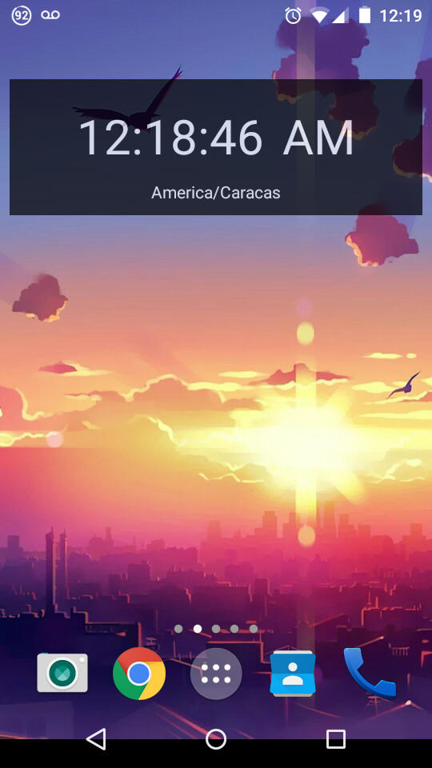
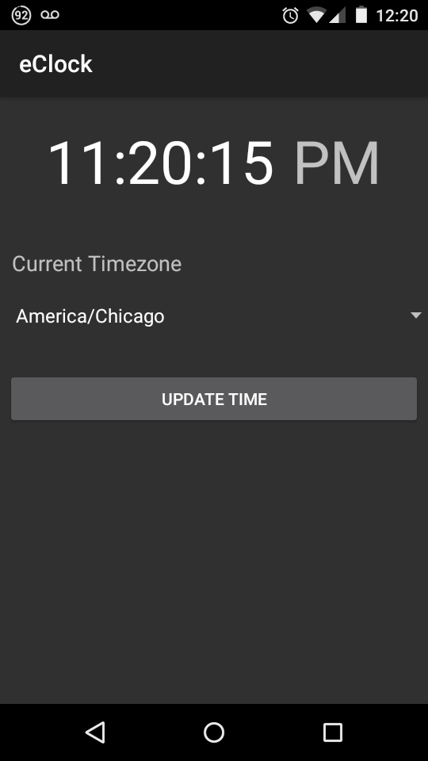

# eClock-Android
An Android Widget built with Xamarin

This is a simple widget, a weekend project motivated by a recent change in the legal hour of my country (+30mins). I don't know why the change broke the time auto configuration supplied to my phone by my actual carrier, I can only say that in a period of two weeks 4 days I was late to my work because sometimes I had the +30mins and sometimes not, and that was driving me crazy.

So as any good developer would do, I created a time widget with no dependency on phone's system time. It uses the [Timezonedb's](https://timezonedb.com/) API to get the time every 30 mins from internet, so this way I could compare the widget's time against phone's system time.

To test this code just download or clone the repo and open it with Visual Studio 2015, then restore the project's packages with Nuget and write your Timezonebd API Key in the Timezone.cs file.

<table>
  <td style="border:none"></td>
  <td style="border:none"></td>
</table>

[License: WTFPL](http://www.wtfpl.net/)
